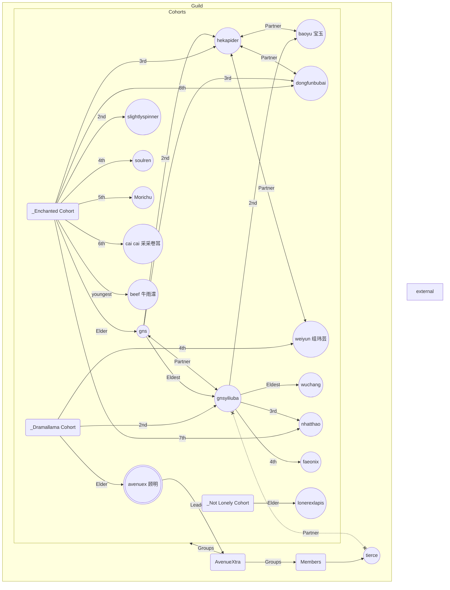

```mermaid
flowchart TB

l(((avenuex 顾明)))
g(AvenueXtra)
c1(_Dramallama Cohort)
c2(_Enchanted Cohort)
c3(_Not Lonely Cohort)
m(Members)
e[external]

m1((gnsyiliuba))
m2((gns))
m3((tierce))
m4((wuchang))
m5((baoyu 宝玉))
m6((nhatthao))
m7((faeonix))
m8((hekapider))
m9((dongfunbubai))
m10((weiyun 组玮芸))
m11((slightlyspinner))
m12((soulren))
m13((Morichu))
m14((cai cai 采采卷耳))
m15((beef 牛雨瀮))
m16((lonerexlapis))

l --> |Leader| g
m1 x-.-x |Partner| m3
m2 <--> |Partner| m1
m2 --> |Eldest| m1
m8 <--> |Partner| m5((baoyu 宝玉))
m8 <--> |Partner| m9((dongfunbubai))
m8 <--> |Partner| m10((weiyun 组玮芸))

subgraph Guild
	g --> |Groups| Cohorts & m
	m --> m3
	subgraph Cohorts
		c1 --> |Elder| l
			c1 --> |2nd| m1
				m1 --> |Eldest| m4
				m1 --> |2nd| m5
				m1 --> |3rd| m6
				m1 --> |4th| m7
			c1 --> |4th| m10
		c2 --> |Elder| m2
				m2 --> |2nd| m8
				m2 --> |3rd| m9
			c2 --> |2nd| m11
			c2 --> |3rd| m8
			c2 --> |4th| m12
			c2 --> |5th| m13
			c2 --> |6th| m14
			c2 --> |7th| m6
			c2 --> |8th| m9
			c2 --> |youngest| m15
		c3 --> |Elder| m16
	end
end


class g,c1,c2,c3,m,e internal-link
class l,m1,m2,m3,m4,m5,m6,m7,m8,m9 internal-link
class m10,m11,m12,m13,m14,m15,m16 internal-link

```