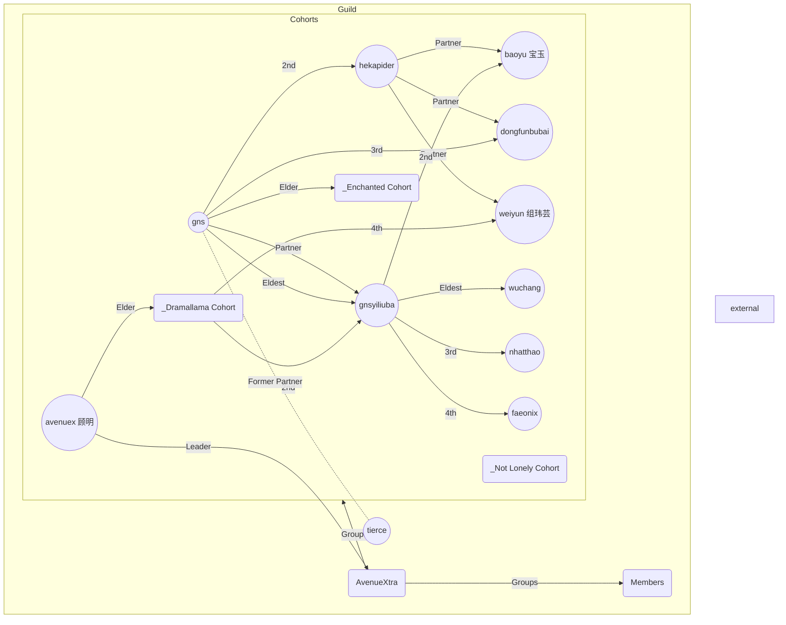

![[banner.png]] 

```mermaid
graph TB

l((avenuex 顾明))
g(AvenueXtra)
c1(_Dramallama Cohort)
c2(_Enchanted Cohort)
c3(_Not Lonely Cohort)
m(Members)
e[external]

m1((gnsyiliuba))
m2((gns))
m3((tierce))
m4((wuchang))
m5((baoyu 宝玉))
m6((nhatthao))
m7((faeonix))
m8((hekapider))
m9((dongfunbubai))
m10((weiyun 组玮芸))

l --> |Leader| g
m2 --> |Partner| m1
m2 --> |Eldest| m1
m8 --> |Partner| m5((baoyu 宝玉))
m8 --> |Partner| m9((dongfunbubai))
m8 --> |Partner| m10((weiyun 组玮芸))

subgraph Guild
	g ---> |Groups| Cohorts & m
	m
	subgraph Cohorts
		l --> |Elder| c1
			c1 --> |2nd| m1
				m1 --> |Eldest| m4
				m1 --> |2nd| m5
				m1 --> |3rd| m6
				m1 --> |4th| m7
			c1 --> |4th| m10
		m2 --> |Elder| c2
			m2 --> |2nd| m8
			m2 --> |3rd| m9
		c3
	end
	m2 -.- |Former Partner| m3
end


class g,c1,c2,c3,m,e internal-link
class l,m1,m2,m3,m4,m5,m6,m7,m8,m9 internal-link
```

---

# [[Cohorts]]
# [[Members]]
# [[GVG]]
