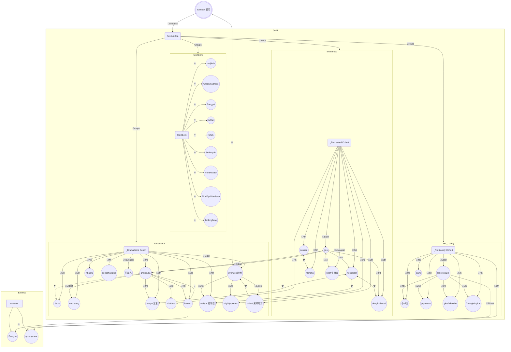

>[!info] [[_Enchanted Cohort]]
>| Role | Member |  
>| :--- | :--- |
>|Great Elder: | [[gns]] |
>|Second Younger: | [[slightlyspinner]] |
>|Third Younger: | [[hekapider]] |
>|Fourth Younger: | [[soulren]] |
>|Fifth Younger: | [[Morichu]] |
>|Sixth Younger: | [[cai cai 采采卷耳]] |
>|Seventh Younger: | [[nhatthao]] |
>|Eighth Younger: | [[dongfunbubai]] |
>|Ninth Younger: | [[beef 牛雨瀮]] |
>|Youngest: | null |

---
# Former
