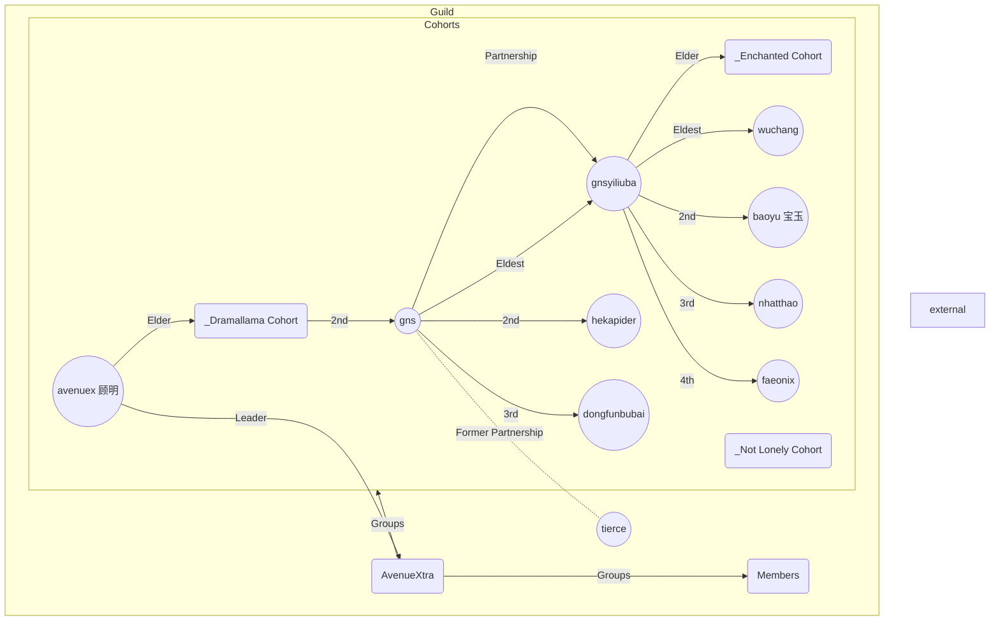

![[banner.png]] 

---
>[!info] Guild
>| | |
>| :--- | :--- |
>|Guild ID: | 10157338 |
>|Members:| ![[avenueXtra.csv]]|
>|Discord: | https://discord.gg/HE6P7NMqY |

---

> [!info]- Graph Legend
> Here is a quick reference for the callouts used in the graph view:
> 
> | Icon | Callout Type | Meaning | |
> | :--- | :--- | :--- | :--- |
> | <svg xmlns="http://www.w3.org/2000/svg" width="24" height="24" viewBox="0 0 24 24" fill="none" stroke="#ffff00" stroke-width="2" stroke-linecap="round" stroke-linejoin="round" class="lucide lucide-circle-icon lucide-circle"><circle cx="12" cy="12" r="10"/></svg> | Leader | [[avenuex 顾明]] | Leader of the guild |
> | <svg xmlns="http://www.w3.org/2000/svg" width="24" height="24" viewBox="0 0 24 24" fill="none" stroke="#969600" stroke-width="2" stroke-linecap="round" stroke-linejoin="round" class="lucide lucide-circle-icon lucide-circle"><circle cx="12" cy="12" r="10"/></svg>| Members | [[Members]] | Guild members|
> | <svg xmlns="http://www.w3.org/2000/svg" width="24" height="24" viewBox="0 0 24 24" fill="none" stroke="#969600" stroke-width="2" stroke-linecap="round" stroke-linejoin="round" class="lucide lucide-circle-icon lucide-circle"><circle cx="12" cy="12" r="10"/></svg> | | [[External]] | Associates of guild members|
> | <svg xmlns="http://www.w3.org/2000/svg" width="24" height="24" viewBox="0 0 24 24" fill="none" stroke="#969600" stroke-width="2" stroke-linecap="round" stroke-linejoin="round" class="lucide lucide-circle-icon lucide-circle"><circle cx="12" cy="12" r="10"/></svg> | Cohorts | [[_Dramallama Cohort]]| |
> | <svg xmlns="http://www.w3.org/2000/svg" width="24" height="24" viewBox="0 0 24 24" fill="none" stroke="#969600" stroke-width="2" stroke-linecap="round" stroke-linejoin="round" class="lucide lucide-circle-icon lucide-circle"><circle cx="12" cy="12" r="10"/></svg> | | [[_Enchanted Cohort]] | |
> | <svg xmlns="http://www.w3.org/2000/svg" width="24" height="24" viewBox="0 0 24 24" fill="none" stroke="#969600" stroke-width="2" stroke-linecap="round" stroke-linejoin="round" class="lucide lucide-circle-icon lucide-circle"><circle cx="12" cy="12" r="10"/></svg> | | [[_Not Lonely Cohort]] | |
> | <svg xmlns="http://www.w3.org/2000/svg" width="24" height="24" viewBox="0 0 24 24" fill="none" stroke="#00ffff" stroke-width="2" stroke-linecap="round" stroke-linejoin="round" class="lucide lucide-circle-icon lucide-circle"><circle cx="12" cy="12" r="10"/></svg> | GVG Role | DPS Role | |
> | <svg xmlns="http://www.w3.org/2000/svg" width="24" height="24" viewBox="0 0 24 24" fill="none" stroke="#ff9600" stroke-width="2" stroke-linecap="round" stroke-linejoin="round" class="lucide lucide-circle-icon lucide-circle"><circle cx="12" cy="12" r="10"/></svg> | | Tank Role| |
> | <svg xmlns="http://www.w3.org/2000/svg" width="24" height="24" viewBox="0 0 24 24" fill="none" stroke="#ff00ff" stroke-width="2" stroke-linecap="round" stroke-linejoin="round" class="lucide lucide-circle-icon lucide-circle"><circle cx="12" cy="12" r="10"/></svg> | | Healer Role | |
> | <svg xmlns="http://www.w3.org/2000/svg" width="24" height="24" viewBox="0 0 24 24" fill="none" stroke="#afbac0" stroke-width="2" stroke-linecap="round" stroke-linejoin="round" class="lucide lucide-circle-icon lucide-circle"><circle cx="12" cy="12" r="10"/></svg> | [[Lore]] | Fanfiction by guildmembers | |
# [[Cohorts]]
# [[Members]]
# [[GVG]]
